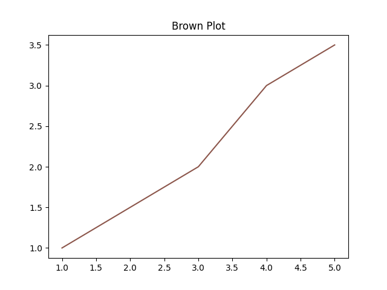

# Another matplotlib example

Let's take another look at [matplotlib](https://matplotlib.org/).  This one will be a little different in that we will generate direct bindings for a couple of matplotlib classes and module functions.

* [Axes](https://matplotlib.org/stable/api/axes_api.html#matplotlib.axes.Axes)
* [Figure](https://matplotlib.org/stable/api/figure_api.html#module-matplotlib.figure)
* [matplotlib.pyplot.subplots](https://matplotlib.org/stable/api/_as_gen/matplotlib.pyplot.subplots.html#matplotlib.pyplot.subplots)

This example will also show you some of the current limitations of `pyml_bindgen` :)

## Value specs

For this example, we won't bother binding all the arguments that these methods take since we won't be using them.

For each of these, I will put down the arguments as shown in the matplotlib docs, the follow it with the OCaml value spec we will use.

### `Axes.set_title`

([docs](https://matplotlib.org/stable/api/_as_gen/matplotlib.axes.Axes.set_title.html#matplotlib.axes.Axes.set_title))

Python:

```
Axes.set_title(label, fontdict=None, loc=None, pad=None, *, y=None, **kwargs)
```

OCaml:

```ocaml
val set_title : t -> label:string -> unit -> unit
```

### `Axes.plot`

([docs](https://matplotlib.org/stable/api/_as_gen/matplotlib.axes.Axes.plot.html#matplotlib.axes.Axes.plot))

Python:

```
Axes.plot(*args, scalex=True, scaley=True, data=None, **kwargs)
```

OCaml:

```ocaml
val plot : t -> x:float list -> y:float list -> ?color:string -> unit -> unit
```

This value spec will generate an `Axes.plot` function actually has a bug.  If you check the docs, you can't actually pass `x` and `y` as keyword arguments.  Oops!  You have to go in and edit the binding by hand.  Below, I will show a [patch file](TODO) with the changes you need to make.

You may be thinking, well, that's pretty annoying...I agree!  For this function, I would probably just write it by hand from the start.  I'm showing it here partly as a reminder that I want to change the behaviour of `pyml_bindgen` in a future release to handle methods like this one.  But for now, you have to deal with it yourself :)

*Note that while we used `float list` for `x` and `y` here, you may want to use `float array` instead.*

### `Figure.savefig`

([docs](https://matplotlib.org/stable/api/figure_api.html#matplotlib.figure.Figure.savefig))

```
savefig(fname, *, transparent=None, **kwargs)
```


```ocaml
val savefig : t -> fname:string -> unit -> unit
```

## Generating `Axes` & `Figure` modules

Let's go over the arguments and options for `pyml_bindgen` that we will need.

Note that we need to specify the correct Python module from which the `Axes` and `Figure` classes come.

* For `Axes`, that's `matplotlib.axes`.
* For `Figure`, that's `matplotlib.figure`.

We use `--caml-module` option again to tell `pyml_bindgen` to generate the module signature as well as the implementation.

We use `-a class` to specify that we want to generate class-associated methods.  Note that this is the default option.

For both invocations, we pipe the output directly to `ocamlformat`.

### Run `pyml_bindgen`

Here are the commands.

```
pyml_bindgen axes_specs.txt matplotlib.axes Axes --caml-module Axes -a class \
  | ocamlformat --enable-outside-detected-project --name=a.ml - \
  > py_class.ml

printf "\n" >> py_class.ml

pyml_bindgen figure_specs.txt matplotlib.figure Figure --caml-module Figure -a class \
  | ocamlformat --enable-outside-detected-project --name=a.ml - \
  >> py_class.ml
```

### Patch the file

Above, I mentioned that you would need to change the implementation for the `Axes` module a bit.  Here is the patch for the lines you need to change.

Here is a patch showing the change I mean

```
--- py_class_bug.ml	2021-10-20 20:21:00.000000000 -0400
+++ py_class.ml	2021-10-20 20:21:00.000000000 -0400
@@ -30,17 +30,21 @@

   let plot t ~x ~y ?color () =
     let callable = Py.Object.find_attr_string t "plot" in
+    let args =
+      [|
+        Py.List.of_list_map Py.Float.of_float x;
+        Py.List.of_list_map Py.Float.of_float y;
+      |]
+    in
     let kwargs =
       filter_opt
         [
-          Some ("x", Py.List.of_list_map Py.Float.of_float x);
-          Some ("y", Py.List.of_list_map Py.Float.of_float y);
           (match color with
           | Some color -> Some ("color", Py.String.of_string color)
           | None -> None);
         ]
     in
-    ignore @@ Py.Callable.to_function_with_keywords callable [||] kwargs
+    ignore @@ Py.Callable.to_function_with_keywords callable args kwargs
 end

 module Figure : sig
```

### Generated output

Here's the whole of the generated output including the patch.

```ocaml
module Axes : sig
  type t

  val of_pyobject : Pytypes.pyobject -> t option

  val to_pyobject : t -> Pytypes.pyobject

  val set_title : t -> label:string -> unit -> unit

  val plot : t -> x:float list -> y:float list -> ?color:string -> unit -> unit
end = struct
  let filter_opt l = List.filter_map Fun.id l

  let import_module () = Py.Import.import_module "matplotlib.axes"

  type t = Pytypes.pyobject

  let is_instance pyo =
    let py_class = Py.Module.get (import_module ()) "Axes" in
    Py.Object.is_instance pyo py_class

  let of_pyobject pyo = if is_instance pyo then Some pyo else None

  let to_pyobject x = x

  let set_title t ~label () =
    let callable = Py.Object.find_attr_string t "set_title" in
    let kwargs = filter_opt [ Some ("label", Py.String.of_string label) ] in
    ignore @@ Py.Callable.to_function_with_keywords callable [||] kwargs

  let plot t ~x ~y ?color () =
    let callable = Py.Object.find_attr_string t "plot" in
    let args =
      [|
        Py.List.of_list_map Py.Float.of_float x;
        Py.List.of_list_map Py.Float.of_float y;
      |]
    in
    let kwargs =
      filter_opt
        [
          (match color with
          | Some color -> Some ("color", Py.String.of_string color)
          | None -> None);
        ]
    in
    ignore @@ Py.Callable.to_function_with_keywords callable args kwargs
end

module Figure : sig
  type t

  val of_pyobject : Pytypes.pyobject -> t option

  val to_pyobject : t -> Pytypes.pyobject

  val savefig : t -> fname:string -> unit -> unit
end = struct
  let filter_opt l = List.filter_map Fun.id l

  let import_module () = Py.Import.import_module "matplotlib.figure"

  type t = Pytypes.pyobject

  let is_instance pyo =
    let py_class = Py.Module.get (import_module ()) "Figure" in
    Py.Object.is_instance pyo py_class

  let of_pyobject pyo = if is_instance pyo then Some pyo else None

  let to_pyobject x = x

  let savefig t ~fname () =
    let callable = Py.Object.find_attr_string t "savefig" in
    let kwargs = filter_opt [ Some ("fname", Py.String.of_string fname) ] in
    ignore @@ Py.Callable.to_function_with_keywords callable [||] kwargs
end
```

## Write the `Pyplot` module

For a little variety, and because we don't need any of the extra stuff that `pyml_bindgen` generates (again, you will be able to control this eventually), let's write this one by hand.

Then you can make a `pyplot.ml` file

```ocaml
open Py_class

let import_module () = Py.Import.import_module "matplotlib.pyplot"

let subplots () =
  let callable = Py.Module.get (import_module ()) "subplots" in
  let args = [||] in
  let kwargs = [] in
  let tup = Py.Callable.to_function_with_keywords callable args kwargs in
  let fig, ax = Py.Tuple.to_tuple2 tup in
  match (Figure.of_pyobject fig, Axes.of_pyobject ax) with
  | Some f, Some a -> Some (f, a)
  | Some _, None | None, Some _ | None, None -> None
```

Note that there are more compact ways to write this with `pyml`, but we will leave it like this to keep it similar to the rest of the generated functions.

## Set up the Dune project and run it

Now we need a dune file and a driver to run our plotting code. Save these two files in the same directory in as the other files.

`dune`

```
(executable
 (name run)
 (libraries pyml))
```

`run.ml`

```ocaml
open Py_class

let () = Py.initialize ()

let figure, axes =
  match Pyplot.subplots () with
  | Some (fig, ax) -> (fig, ax)
  | None -> failwith "Failed to make figure and axes!"

let x = [ 1.; 2.; 3.; 4.; 5. ]
let y = [ 1.; 1.5; 2.; 3.; 3.5 ]

let () = Axes.set_title axes ~label:"Brown Plot" ()
let () = Axes.plot axes ~x ~y ~color:"tab:brown" ()
let () = Figure.savefig figure ~fname:"brown_plot.png" ()
```

Run it like so:

```
$ dune exec ./run.exe
```

If all goes well, you should see a nice, brown line plot:



## Wrap up

In this tutorial, we generating bindings for a couple of matplotlib classes and functions.  You saw how to combine multiple generated modules as well as some of the little workarounds you still have to do.

Like all the examples so far, we're only binding a couple of classes & functions.  For such a small thing, feel free to write your bindings by hand.  These two classes alone have tons of functions though, so if you were binding them all, that would be a pain to write by hand!
