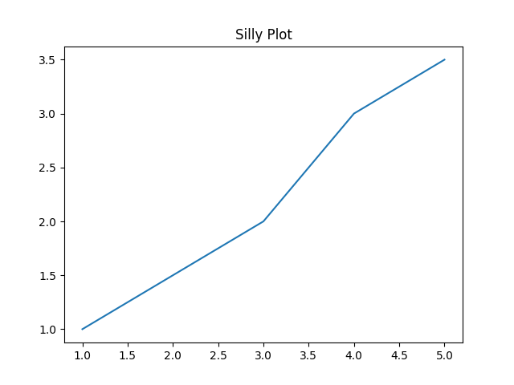
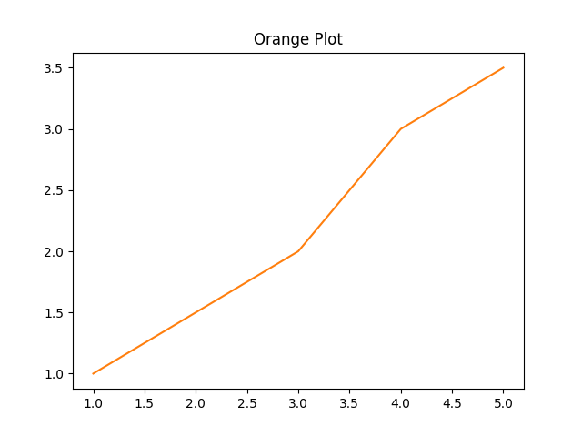

# Matplotlib Example

Okay, okay...this is a sort of fake example.  Instead of wrapping a whole bunch of [matplotlib](https://matplotlib.org/) code, we're just going to bind a little class that wraps some basic plotting functionality.  Just pretend it's some cool coworker's code that you want to access from OCaml :)

```python
import matplotlib.pyplot as plt

class Plotter:
    def __init__(self):
        self.fig, self.ax = plt.subplots()

    def set_title(self, title):
        self.ax.set_title(title)

    def plot(self, x, y, color='tab:blue'):
        self.ax.plot(x, y, color=color)

    def save(self, filename):
        self.fig.savefig(filename)
```

As you can see, it's a simple class that wraps some `matplotlib` functionality.  This example is a bit different than the [first one](getting-started.md) in that no meaningful values are ever returned from the Python methods.  It's all just state internal to the Python objects.  While you could probably imagine a nicer interface to this class that hides away all the yuck, we are just going to do a straight binding of the methods as they are.

Unlike the last example, we are not going to bother with exposing the attributes, since the caller won't need them.  We will do all the methods though.

Recall that when binding instance methods, the first argument must be `t`, the last argument must be `unit`, and the remaining arguments must be named or optional.

## Value specs

### \__init__

This `__init__` function takes no arguments, and returns an instance of `Plotter`.

```ocaml
val __init__ : unit -> t
```

### set_title

`set_title` takes a single string argument `title`, (and `self` of course, but we don't worry about that from the OCaml side).  In Python-land, `set_title` returns `None`.  In cases like this, we want an OCaml function that returns `unit`.

```ocaml
val set_title : t -> title:string -> unit -> unit
```

We have `unit -> unit` because the return type is `unit`, and the final argument of the function needs to be `unit`.

### plot

The `plot` function is kind of interesting since it takes an optional argument `color`.  Just because the argument is optional on the Python side doesn't mean that we have to make it optional on the OCaml side, but let's go ahead and make it optional to match the Python API to show you how it's done.  (While you could definitely imagine using some sort of variant for a color argument, we will just match the Python and use a string.)

```ocaml
val plot : t -> x:float list -> y:float list -> ?color:string -> unit -> unit
```

Not bad!  You just make it like any old OCaml optional argument.

### save

Finally, the `save` function.  Nothing new to talk about so I'll just put down the spec.

```ocaml
val save : t -> filename:string -> unit -> unit
```

Put those all in a file called `val_specs.txt`.  Here it is for easy copy-pasting.

```ocaml
val __init__ : unit -> t
val set_title : t -> title:string -> unit -> unit
val plot : t -> x:float list -> y:float list -> ?color:string -> unit -> unit
val save : t -> filename:string -> unit -> unit
```

## Run `pyml_bindgen`

Run the following command to generate the OCaml module.

```
$ pyml_bindgen val_specs.txt plotter Plotter --caml-module=Plotter --of-pyo-ret-type=no_check > lib.ml
```

*For more info about the options, see the [getting started](getting-started.md) example.*

For reference, here is the generated source code after running `ocamlformat`.

```ocaml
let filter_opt l = List.filter_map Fun.id l

let import_module () = Py.Import.import_module "plotter"

module Plotter : sig
  type t

  val of_pyobject : Pytypes.pyobject -> t

  val to_pyobject : t -> Pytypes.pyobject

  val __init__ : unit -> t

  val set_title : t -> title:string -> unit -> unit

  val plot : t -> x:float list -> y:float list -> ?color:string -> unit -> unit

  val save : t -> filename:string -> unit -> unit
end = struct
  type t = Pytypes.pyobject

  let of_pyobject pyo = pyo

  let to_pyobject x = x

  let __init__ () =
    let callable = Py.Module.get (import_module ()) "Plotter" in
    let kwargs = filter_opt [] in
    of_pyobject @@ Py.Callable.to_function_with_keywords callable [||] kwargs

  let set_title t ~title () =
    let callable = Py.Object.find_attr_string t "set_title" in
    let kwargs = filter_opt [ Some ("title", Py.String.of_string title) ] in
    ignore @@ Py.Callable.to_function_with_keywords callable [||] kwargs

  let plot t ~x ~y ?color () =
    let callable = Py.Object.find_attr_string t "plot" in
    let kwargs =
      filter_opt
        [
          Some ("x", Py.List.of_list_map Py.Float.of_float x);
          Some ("y", Py.List.of_list_map Py.Float.of_float y);
          (match color with
          | Some color -> Some ("color", Py.String.of_string color)
          | None -> None);
        ]
    in
    ignore @@ Py.Callable.to_function_with_keywords callable [||] kwargs

  let save t ~filename () =
    let callable = Py.Object.find_attr_string t "save" in
    let kwargs =
      filter_opt [ Some ("filename", Py.String.of_string filename) ]
    in
    ignore @@ Py.Callable.to_function_with_keywords callable [||] kwargs
end
```

## Set up the Dune project

Now we need a `dune` file and a driver to run our plotting code.  Save these two files in the same directory in which you generated the `lib.ml` file.

`dune`

```
(executable
 (name run)
 (libraries pyml))
```

`run.ml`

```ocaml
open Lib

let () = Py.initialize ()

let x = [ 1.; 2.; 3.; 4.; 5. ]
let y = [ 1.; 1.5; 2.; 3.; 3.5 ]

let plotter = Plotter.__init__ ()
let () = Plotter.set_title plotter ~title:"Silly Plot" ()
(* See how [color] is optional? *)
let () = Plotter.plot plotter ~x ~y ()
let () = Plotter.save plotter ~filename:"silly_plot.png" ()

let plotter = Plotter.__init__ ()
let () = Plotter.set_title plotter ~title:"Orange Plot" ()
(* Here, we pass the [color] argument. *)
let () = Plotter.plot plotter ~x ~y ~color:"tab:orange" ()
let () = Plotter.save plotter ~filename:"orange_plot.png" ()
```

And now, go ahead and run that.

```
$ dune exec ./run.exe
```

If all goes well, you should see a couple of PNG files there.  Here's what they should look like.

The first plot, with default colors:



And the orange plot:



Pretty cool, right?

## Wrap up

Okay, so this was kind of a goofy example.  It's a little artificial, as you probably would want to just bind to `matplotlib` directly, but to keep things simple, we just used a simple class that binds some `matplotlib` functionality.

It did show you some new stuff, though, and we got to make some cute plots! 📈 📊
